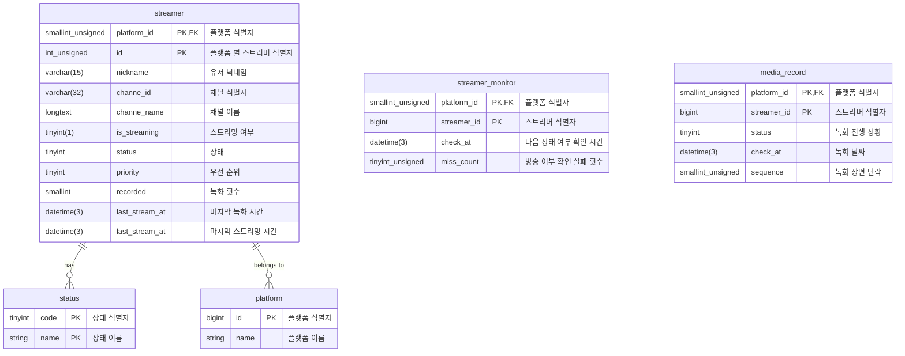

# mntreamer (엠엔트리머)

## 🧑‍💻: Intro
❓ Problem : 스트리머가 방송을 시작했는지 실시간으로 확인하기 어려움 😮
- 방송 여부를 지속적으로 확인하는 과정에서 API 호출 비용 증가
- 안정적인 녹화 시스템 부재

❗ Idea : 계단식 백오프 전략을 활용한 효율적인 방송 여부 확인 및 녹화 시스템을 만들자 🤔
- 일정 시간 간격으로 스트리머 상태를 조회하며 빈도 조정
- 방송 여부 확인하면 자동 녹화 시작

💯 Solution : 효율적이고 자동화된 녹화 시스템 구현 😁
- 데이터베이스에 저장된 스트리머 정보를 기반으로 방송 상태를 주기적으로 확인
- 방송 중인 경우 m3u8 & ts 형식 파일로 저장 및 관리

</br>

## 🧱: Structure
```
cmd
    ├── media
    │   └── cmd
    │       ├── api
    │       │   ├── domain
    │       │   │   ├── business
    │       │   │   │   └── parser
    │       │   │   │       ├── businessInterface.go
    │       │   │   │       └── m3u8Business.go
    │       │   │   └── service
    │       │   │       ├── serviceInterface.go
    │       │   │       ├── shellScriptService.go
    │       │   │       └── shellScriptService_test.go
    │       │   ├── infrastructure
    │       │   │   └── repository
    │       │   │       ├── repository.go
    │       │   │       └── repositoryInterface.go
    │       │   └── presentation
    │       │       ├── controller
    │       │       │   └── controllerInterface.go
    │       │       └── handler
    │       │           ├── handler.go
    │       │           └── handlerInterface.go
    │       ├── configuration
    │       │   ├── dependencyInjection.go
    │       │   ├── monolithic.go
    │       │   └── secret.go
    │       ├── go.mod
    │       ├── go.sum
    │       ├── lib
    │       ├── main.go
    │       └── model
    │           ├── buffers.go
    │           ├── fileInfo.go
    │           ├── media.go
    │           └── mediaPlaylist.go
    ├── monitor
    │   └── cmd
    │       ├── api
    │       │   ├── domain
    │       │   │   ├── business
    │       │   │   └── service
    │       │   │       ├── service.go
    │       │   │       └── serviceInterface.go
    │       │   ├── infrastructure
    │       │   │   ├── externalApi
    │       │   │   │   ├── platform
    │       │   │   │   └── streamer
    │       │   │   └── repository
    │       │   │       ├── repository.go
    │       │   │       └── repositoryInterface.go
    │       │   └── presentation
    │       │       ├── controller
    │       │       │   └── controllerInterface.go
    │       │       └── handler
    │       │           ├── handler.go
    │       │           └── handlerInterface.go
    │       ├── configuration
    │       │   ├── dependencyInjection.go
    │       │   ├── monolithic.go
    │       │   └── secret.go
    │       ├── go.mod
    │       ├── go.sum
    │       ├── lib
    │       ├── main.go
    │       └── model
    │           └── monitor.go
    ├── monolithic
    │   └── cmd
    │       ├── api
    │       │   ├── media
    │       │   │   └── presentation
    │       │   │       └── controller
    │       │   │           └── controller.go
    │       │   ├── monitor
    │       │   │   ├── infrastructure
    │       │   │   │   └── repository
    │       │   │   └── presentation
    │       │   │       └── controller
    │       │   │           └── controller.go
    │       │   ├── platform
    │       │   │   ├── domain
    │       │   │   │   └── service
    │       │   │   └── infrastructure
    │       │   └── streamer
    │       ├── configuration
    │       │   ├── dependencyInjection.go
    │       │   └── secret.go
    │       ├── __debug_bin2387217475
    │       ├── __debug_bin4288232346
    │       ├── go.mod
    │       ├── go.sum
    │       ├── lib
    │       │   └── monolithic.go
    │       ├── main.go
    │       └── nohup.out
    ├── platform
    │   └── cmd
    │       ├── api
    │       │   ├── domain
    │       │   │   ├── business
    │       │   │   │   ├── businessInterface.go
    │       │   │   │   └── chzzkBusiness.go
    │       │   │   └── service
    │       │   │       ├── service.go
    │       │   │       └── serviceInterface.go
    │       │   ├── infrastructure
    │       │   │   ├── externalApi
    │       │   │   │   ├── chzzkClient.go
    │       │   │   │   └── clientInterface.go
    │       │   │   └── repository
    │       │   │       ├── repositoryInterface.go
    │       │   │       └── repostiory.go
    │       │   └── presentation
    │       ├── configuration
    │       │   ├── dependencyInjection.go
    │       │   ├── monolithic.go
    │       │   └── secret.go
    │       ├── go.mod
    │       ├── go.sum
    │       ├── lib
    │       │   └── platform.go
    │       ├── main.go
    │       └── model
    │           └── platform.go
    ├── shared
    │   ├── common
    │   │   └── api
    │   │       ├── IBusiness.go
    │   │       ├── IController.go
    │   │       ├── IHandler.go
    │   │       ├── IRepository.go
    │   │       └── IService.go
    │   ├── configuration
    │   │   └── dependencyInjection.go
    │   ├── database
    │   │   ├── mySqlDatabase.go
    │   │   └── neo4jDatabase.go
    │   ├── go.mod
    │   ├── go.sum
    │   ├── middleware
    │   │   └── kamsi
    │   │       └── cmd
    │   │           ├── component
    │   │           │   ├── appender
    │   │           │   │   ├── appenderInterface.go
    │   │           │   │   ├── statsdAppender.go
    │   │           │   │   └── statsdAppender_test.go
    │   │           │   ├── buffer
    │   │           │   │   ├── bufferInterface.go
    │   │           │   │   ├── countBuffer.go
    │   │           │   │   └── lengthBuffer.go
    │   │           │   ├── bufferPool
    │   │           │   │   ├── bufferPoolInterface.go
    │   │           │   │   └── lengthBufferPool.go
    │   │           │   ├── logging
    │   │           │   │   └── error.go
    │   │           │   └── tag
    │   │           │       └── tag.go
    │   │           ├── configuration
    │   │           │   ├── dependencyInjection.go
    │   │           │   └── secret.go
    │   │           ├── go.mod
    │   │           ├── go.sum
    │   │           ├── lib
    │   │           │   └── kamsi.go
    │   │           └── main.go
    │   ├── model
    │   │   ├── liveDetail.go
    │   │   ├── status.go
    │   │   └── streamer.go
    │   └── proto
    │       └── miner
    │           ├── miner_grpc.pb.go
    │           ├── miner.pb.go
    │           └── miner.proto
    ├── streamer
    │   └── cmd
    │       ├── api
    │       │   ├── domain
    │       │   │   ├── business
    │       │   │   └── service
    │       │   │       ├── service.go
    │       │   │       └── serviceInterface.go
    │       │   ├── infrastructure
    │       │   │   ├── client
    │       │   │   └── repository
    │       │   │       ├── repositoryInterface.go
    │       │   │       └── repostiory.go
    │       │   └── presentation
    │       ├── configuration
    │       │   ├── dependencyInjection.go
    │       │   ├── monolithic.go
    │       │   └── secret.go
    │       ├── go.mod
    │       ├── go.sum
    │       ├── lib
    │       │   └── streamer.go
    │       ├── main.go
    │       └── model
```
</br>

## 🛢️: Entity Relationship Diagram


## ✅: Implementation
### 계단식 백오프 
```golang
func (s *Service) UpdateCheckAt(tx *gorm.DB, streamerMonitor *model.StreamerMonitor) {

	switch {
	case streamerMonitor.MissCount < 12:
		streamerMonitor.CheckAt = time.Now().Add(1 * time.Minute)
	case streamerMonitor.MissCount < 24:
		streamerMonitor.CheckAt = time.Now().Add(3 * time.Minute)
	case streamerMonitor.MissCount < 36:
		streamerMonitor.CheckAt = time.Now().Add(10 * time.Minute)
	case streamerMonitor.MissCount < 48:
		streamerMonitor.CheckAt = time.Now().Add(15 * time.Minute)
	case streamerMonitor.MissCount < 60:
		streamerMonitor.CheckAt = time.Now().Add(30 * time.Minute)
	case streamerMonitor.MissCount < 62:
		streamerMonitor.CheckAt = time.Now().Add(40 * time.Minute)
	default:
		streamerMonitor.CheckAt = time.Now().Add(50 * time.Minute)
		streamerMonitor.MissCount = 0
	}
	s.repo.UpdateTx(tx, streamerMonitor)
}
```
- 스트리머 방송 상태 확인 실패 시 재시도 간격을 비선형적 계단식 증가로 설정하여 시스템 부하를 최적화
### M3u8 인코딩 / 디코딩
- [MediaPlaylist모델](https://github.com/hyeonwoody/mntreamer/blob/master/golang/cmd/media/cmd/model/mediaPlaylist.go)
- MediaPlaylist 모델을 사용하여 특정 구간을 삭제한 후 #DISCONTINUITY 태그를 삽입 후, 재생 목록을 재구성


## 📞: Contact
- 이메일: hyeonwoody@gmail.com
- 블로그: https://velog.io/@hyeonwoody
- 깃헙: https://github.com/hyeonwoody

</br>

## 🛠️: Technologies Used
> Go 1.23.5

</br>

## 📚: Libraries Used
> [Gin Web Framework](https://github.com/gin-gonic/gin)

> [playwright-go](https://github.com/playwright-community/playwright-go)

> Ffmpeg 4.4.4
